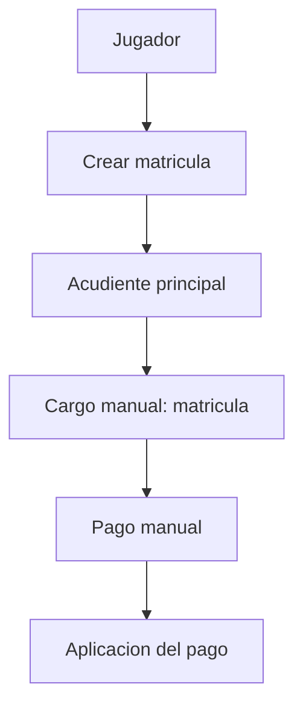

# EP-009 Billing Model Evolution

## Contexto

Este documento registra la evolución deseada del modelo de cobro asociado a `EP-009` a partir de las conversaciones de dominio sobre matrícula, mensualidades, uniformes, pólizas, promociones y academias con reglas de cobro distintas.

La intención no es implementar nada ahora, sino dejar documentado el criterio para las siguientes mejoras bajo una adopción de SDD liviano:

- `specs/` sigue siendo la fuente canónica de reglas vigentes.
- `docs/backlog/` conserva la intención funcional y la evolución de las historias.
- `docs/architecture/` guarda la decisión, los tradeoffs y los diagramas.

## Lo que hoy existe

En el estado actual, la matrícula funciona de forma simple:

- Se crea la matrícula.
- Se asocia un acudiente principal.
- Se genera, como práctica operativa, un solo cargo manual del concepto `matricula`.
- El pago se registra después de forma manual.

En el dominio financiero actual ya existen piezas suficientes para sostener ese flujo:

- `Membership` controla la pertenencia del jugador a la academia.
- `PaymentConcept` define el catálogo de conceptos.
- `Charge` representa el cargo pendiente o pagado.
- `Payment` registra el dinero recibido.
- `PaymentAllocation` distribuye un pago contra uno o varios cargos.

La limitación no es técnica inmediata, sino de modelo: hoy el comportamiento depende demasiado de la forma en que se opera el cargo, y no de una política formal de matrícula.

## Casos de uso discutidos

### 1. Academia tradicional y simple

Ejemplo:

- La matrícula equivale al pago de la primera mensualidad.
- No incluye otros conceptos.
- La mensualidad puede cambiar por año o por campaña.

Este caso es común cuando la academia quiere simplicidad operativa y no maneja paquetes complejos.

### 2. Academia con paquete de ingreso

Ejemplo:

- Matrícula: `320.000`
- Incluye:
  - uniforme de competencia
  - póliza
  - primera mensualidad
- Luego cada mes se paga `90.000`
- Además existe el uniforme de entrenamiento como concepto aparte

Este caso muestra que la matrícula no siempre es un solo cargo; puede ser un contenedor de varios conceptos.

### 3. Academia con promociones y cambios de precio

Ejemplo:

- En 2025 la mensualidad cuesta `80.000`
- En 2026 sube a `90.000`
- A mitad de año puede existir una campaña y bajar temporalmente a `45.000`

Este caso exige que el precio no quede amarrado a un único valor fijo en el código ni en un cargo aislado.

### 4. Academia con esquema tradicional

Ejemplo:

- Solo cobra matrícula como concepto administrativo
- No necesita descomponerla en componentes internos

Este caso es importante porque no toda academia necesita el mismo nivel de complejidad.

## Propuesta de enfoque

La recomendación no es convertir todo en una solución sofisticada de entrada, sino separar el problema en niveles:

1. Definir la política de cobro de matrícula.
2. Permitir que una política genere uno o varios cargos.
3. Permitir que esos cargos se creen como resultado de reglas de negocio y no como lógica dispersa.
4. Mantener compatibilidad con el caso simple.

### Conceptos propuestos para el dominio

- `MembershipBillingPolicy`: define cómo se cobra una matrícula.
- `EnrollmentPackage`: agrupa conceptos incluidos en la inscripción.
- `BillingItem`: representa un componente cobrable dentro del paquete.
- `PriceSchedule`: define vigencias de precio por periodo.
- `Promotion`: aplica descuentos temporales.
- `Charge`: ejecuta el cobro concreto.

Esto permitiría modelar academias distintas sin romper el comportamiento base.

## Diagrama antes

Este es el flujo simplificado que hoy domina la operación:



## Diagrama hoy

Este es el flujo que conviene documentar como objetivo de evolucion bajo SDD:

```mermaid
flowchart TD
    A[Jugador] --> B[Matricula]
    B --> C[Seleccion de politica de cobro]
    C --> D{Politica simple?}
    D -->|Si| E[Un solo cargo]
    D -->|No| F[Paquete de matricula]
    F --> G[Uniforme competencia]
    F --> H[Uniforme entrenamiento]
    F --> I[Poliza]
    F --> J[Primera mensualidad]
    C --> K[Precio vigente / promocion]
    E --> L[Cargo(s) generados]
    G --> L
    H --> L
    I --> L
    J --> L
    K --> L
    L --> M[Pago o pagos parciales]
    M --> N[Aplicacion a cargos]
```

## Ventajas de modelarlo con SDD

- Hace visible la regla de negocio antes de codificarla.
- Reduce ambiguedad entre “matricula”, “cargo”, “paquete” y “mensualidad”.
- Permite documentar variantes por academia sin perder una base comun.
- Facilita que futuras features no contradigan decisiones ya adoptadas.
- Ayuda a que el agente y la persona que mantiene el proyecto trabajen sobre la misma fuente de verdad.
- Hace mas simple detectar cuando una historia requiere cambio de dominio y no solo un ajuste tecnico.

## Desventajas o costos

- Exige disciplina para mantener docs y codigo sincronizados.
- Puede generar sobre-documentacion si una academia solo necesita el caso simple.
- Agrega trabajo inicial antes de ver valor funcional completo.
- Si se modela demasiado pronto, existe riesgo de sobredisenar casos que aun no se usan.
- Requiere definir muy bien que vive en `specs/`, que vive en `docs/backlog/` y que queda en `docs/architecture/`.

## Criterio recomendado

Para este proyecto, la mejor estrategia es una adopcion escalonada:

- Mantener el caso simple como comportamiento base.
- Documentar la politica de cobro como capacidad extensible.
- No forzar que todas las academias usen paquetes complejos.
- Permitir que una academia tradicional siga cobrando solo una mensualidad.
- Permitir que otra academia cobre un paquete con varios conceptos incluidos.

## Impacto en futuras features

Este documento debe servir como referencia para:

- evolucionar `EP-009`
- ajustar el modelo financiero de `EP-012`
- definir promociones o campañas
- soportar variaciones de mensualidad por periodo
- separar un cobro administrativo de un cobro realmente compuesto

## Estado actual de la decision

No implementada.

Se documenta como base de analisis para las siguientes mejoras funcionales.
