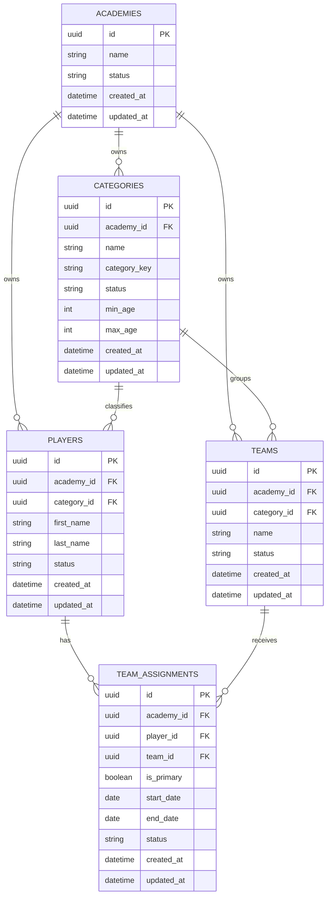

# Team Assignment / Category / Lifecycle Analysis

## Fecha

2026-08-17

## Contexto

Esta nota resume la discusión de diseño alrededor de:

- categorias de jugador y su relacion con la evaluacion tecnica;
- asignacion de equipos principales y secundarios;
- duracion operativa de asignaciones;
- necesidad o no de historico separado;
- impacto en backlog, spec y pruebas.

## Hallazgos Principales

### 1. La categoria no se mueve automaticamente por edad

La categoria del jugador no debe interpretarse como una promocion automatica por cumpleaños.
En este proyecto la categoria responde mas a un marco de evaluacion tecnica y elegibilidad que a un reloj cronologico rigido.

Implicacion:

- la edad sigue siendo un dato relevante para validacion y referencia;
- el cambio de categoria debe ser una decision explicita del negocio;
- el sistema no debe asumir migracion de categoria por defecto.

### 2. La asignacion a equipos es operativa, no un simple catalogo

El modelo de `TeamAssignment` representa la asignacion vigente del jugador a un equipo, con posibilidad de distinguir:

- equipo principal;
- equipo secundario o excepcional;
- fecha de inicio automatica;
- finalizacion explicita solo cuando el negocio lo determine.

Implicacion:

- la asignacion debe conservar trazabilidad de vigencia;
- el historial operativo puede deducirse del propio ciclo de vida del registro;
- si mas adelante hace falta un timeline mas rico, podria surgir una entidad historica complementaria.

### 3. El historico separado aun no es obligatorio

No hay evidencia suficiente para imponer una tabla historica adicional hoy.
Con el modelo actual, `team_assignments` ya puede sostener:

- estado actual;
- fecha de inicio;
- fecha de fin cuando exista;
- bandera de principal;
- auditoria de cambios.

Decision provisional:

- mantener `TeamAssignment` como tabla operativa;
- postergar una entidad historica independiente hasta que el negocio lo exija.

### 4. La regla de maximo dos equipos activos sigue siendo una hipotesis de negocio, no una ley universal

La conversacion deja una posible regla operacional:

- un jugador suele tener un equipo principal;
- puede tener un segundo equipo excepcional por torneo o necesidad deportiva;
- una regla de capacidad maxima podria existir.

Pero aun no debe tratarse como contrato cerrado si no esta aprobada como regla formal.

### 5. La finalizacion manual no debe convertirse en carga operativa diaria

Finalizar asignaciones manualmente para toda la academia no es una buena experiencia si el volumen crece.
La finalizacion deberia depender de eventos claros del negocio, por ejemplo:

- cambio de categoria;
- cierre de torneo;
- cierre de temporada;
- reasignacion explicita.

### 6. La UI debe distinguir principal vs secundario sin complicar el contrato

La experiencia visual puede resolver la diferencia con una simple bandera o estilo, sin forzar estructuras complejas en el response.

## Impacto En Documentacion

### Backlog

- Las reglas nuevas o refinadas deben quedar en las HUs correspondientes de `EP-010-team-assignment` si siguen siendo evoluciones del mismo dominio.
- Si la capacidad crece mucho, puede justificar una nueva epica de gestion deportiva.

### Specs

- `specs/010-team-assignment/` debe seguir siendo la referencia canonica del contrato actual.
- Cualquier regla futura de historico separado o cierre por eventos debe declararse alli primero.

### Codigo

- `TeamAssignment` queda como modelo operativo principal.
- No se introduce historico separado sin necesidad real.
- El `startDate` automatico y la semantica de `isPrimary` ya estan alineados con el contrato vigente.

## Decisiones Temporales

1. La categoria no cambia automaticamente por edad.
2. `TeamAssignment` sigue siendo la tabla principal de asignacion operativa.
3. No se crea historico aparte por ahora.
4. La finalizacion debe responder a reglas de negocio, no a tareas manuales masivas.
5. La capacidad de maximo dos equipos activos queda como regla candidata, no definitiva.

## Pendientes De Definicion

- Confirmar si el limite de dos equipos activos se vuelve regla formal.
- Definir si la finalizacion de asignaciones requiere automatizacion por temporada o por cambio de categoria.
- Decidir si el negocio pedira un timeline historico separado en una fase posterior.

## Trazabilidad

Esta nota debe mantenerse sincronizada con:

- `docs/architecture/memory/project-memory.md`
- `specs/14-current-state.md`
- `specs/010-team-assignment/spec.md`
- `docs/backlog/epics/EP-010-player-team-assignment.md`

## Propuesta De Base De Datos

La siguiente vista resume el modelo relacional propuesto para sostener la
asignacion deportiva del jugador sin introducir un historico separado por
ahora.

## Lectura Del Modelo Propuesto

- `CATEGORIES` conserva la referencia de elegibilidad y organizacion por edad o
  criterio tecnico.
- `PLAYERS` conserva la categoria activa del jugador como referencia operativa.
- `TEAMS` depende de una categoria para asegurar coherencia deportiva.
- `TEAM_ASSIGNMENTS` representa la asignacion vigente y su vigencia temporal.
- `is_primary` resuelve la prioridad de un equipo sin obligar a una tabla de
  historico separada.

## Observacion

Si en una futura iteracion el negocio exige un timeline detallado de cambios,
puede agregarse una entidad historica complementaria sin romper este modelo
operativo.
