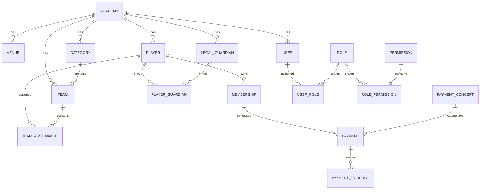

# Entity Relationship Diagram

```mermaid
erDiagram

ACADEMY ||--o{ VENUE : has
ACADEMY ||--o{ USER : has
ACADEMY ||--o{ CATEGORY : has
ACADEMY ||--o{ TEAM : has
ACADEMY ||--o{ PLAYER : has
ACADEMY ||--o{ LEGAL_GUARDIAN : has

CATEGORY ||--o{ TEAM : contains

PLAYER ||--o{ MEMBERSHIP : owns

PLAYER ||--o{ TEAM_ASSIGNMENT : assigned
TEAM ||--o{ TEAM_ASSIGNMENT : contains

PLAYER ||--o{ PLAYER_GUARDIAN : linked
LEGAL_GUARDIAN ||--o{ PLAYER_GUARDIAN : linked

MEMBERSHIP ||--o{ PAYMENT : generates

PAYMENT_CONCEPT ||--o{ PAYMENT : categorizes

PAYMENT ||--o{ PAYMENT_EVIDENCE : contains

USER ||--o{ USER_ROLE : assigned
ROLE ||--o{ USER_ROLE : grants

ROLE ||--o{ ROLE_PERMISSION : grants
PERMISSION ||--o{ ROLE_PERMISSION : contains
```