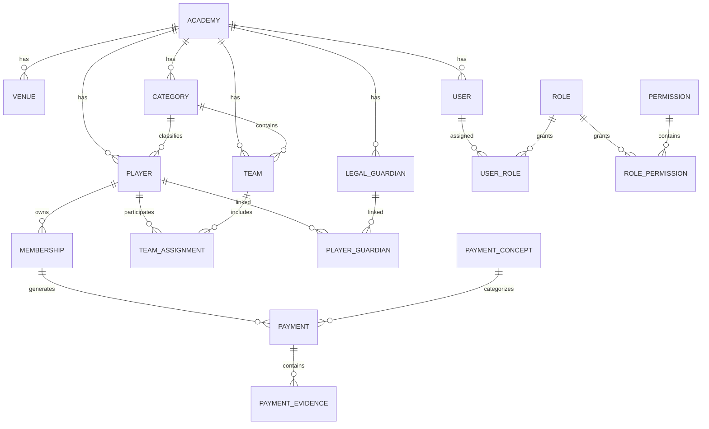

# 04-erd.md

# Entity Relationship Diagram

El siguiente diagrama representa el modelo entidad-relación del MVP de PlayerTech.

La estructura sigue un enfoque **Player-Centric**, donde el jugador es la entidad central del dominio y la formación, la administración y la competición se modelan como procesos independientes.

---

## Principios del Modelo

El modelo entidad-relación se basa en las siguientes reglas de negocio:

- Una academia puede administrar múltiples sedes, categorías, equipos, jugadores y acudientes.
- Todo jugador pertenece a una única categoría administrativa activa.
- Una categoría puede contener múltiples equipos competitivos.
- Un jugador puede participar simultáneamente en múltiples equipos mediante `TeamAssignment`.
- La matrícula representa la permanencia administrativa del jugador y es independiente de su participación deportiva.
- Los pagos siempre se asocian a una matrícula válida.
- Los acudientes se relacionan con los jugadores mediante `PlayerGuardian`, permitiendo relaciones N:M.

---

## Notas

Este diagrama representa únicamente las entidades incluidas en el **MVP**.

Los siguientes módulos se incorporarán en futuras versiones sin modificar la estructura principal del modelo:

- Entrenamientos (`TrainingSession`)
- Asistencia (`Attendance`)
- Entrenadores (`Coach`)
- Torneos (`Tournament`)
- Partidos (`Match`)
- Convocatorias (`MatchSquad`)
- Estadísticas (`PlayerStatistics`)