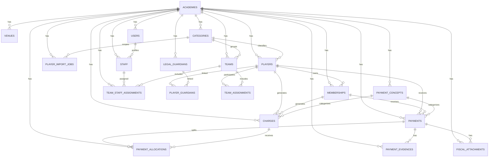

# Entity Relationship Diagram

El diagrama refleja el modelo relacional actual del backend de PlayerTech.

La estructura mantiene `academy` como raíz multi-tenant y `player` como centro operativo del dominio deportivo.

```mermaid
erDiagram

ACADEMIES ||--o{ VENUES : has
ACADEMIES ||--o{ CATEGORIES : has
ACADEMIES ||--o{ PLAYERS : has
ACADEMIES ||--o{ PLAYER_IMPORT_JOBS : has
ACADEMIES ||--o{ LEGAL_GUARDIANS : has
ACADEMIES ||--o{ TEAMS : has
ACADEMIES ||--o{ MEMBERSHIPS : has
ACADEMIES ||--o{ CHARGES : has
ACADEMIES ||--o{ PAYMENT_CONCEPTS : has
ACADEMIES ||--o{ PAYMENTS : has
ACADEMIES ||--o{ PAYMENT_ALLOCATIONS : has
ACADEMIES ||--o{ PAYMENT_EVIDENCES : has
ACADEMIES ||--o{ FISCAL_ATTACHMENTS : has
ACADEMIES ||--o{ STAFF : has
ACADEMIES ||--o{ TEAM_STAFF_ASSIGNMENTS : has
ACADEMIES ||--o{ USERS : has

CATEGORIES ||--o{ PLAYERS : classifies
CATEGORIES ||--o{ TEAMS : groups
CATEGORIES ||--o{ PLAYER_IMPORT_JOBS : scopes

PLAYERS ||--o{ PLAYER_GUARDIANS : linked
LEGAL_GUARDIANS ||--o{ PLAYER_GUARDIANS : linked

PLAYERS ||--o{ MEMBERSHIPS : owns
PLAYERS ||--o{ TEAM_ASSIGNMENTS : participates
PLAYERS ||--o{ CHARGES : generates
PLAYERS ||--o{ PAYMENTS : receives

MEMBERSHIPS ||--o{ CHARGES : generates
MEMBERSHIPS ||--o{ PAYMENTS : receives

PAYMENT_CONCEPTS ||--o{ CHARGES : categorizes
PAYMENT_CONCEPTS ||--o{ PAYMENTS : categorizes

PAYMENTS ||--o{ PAYMENT_ALLOCATIONS : splits
CHARGES ||--o{ PAYMENT_ALLOCATIONS : receives

PAYMENTS ||--o{ PAYMENT_EVIDENCES : has
PAYMENTS ||--o{ FISCAL_ATTACHMENTS : has

TEAMS ||--o{ TEAM_ASSIGNMENTS : includes
STAFF ||--o{ TEAM_STAFF_ASSIGNMENTS : assigned
TEAMS ||--o{ TEAM_STAFF_ASSIGNMENTS : includes

USERS ||--o{ STAFF : profiles
```

---

## Principios del Modelo

- Cada tabla de negocio pertenece a una sola academia.
- El campo `category_id` es el vínculo funcional más importante para jugadores y equipos.
- `PlayerImportJob` permite trazabilidad sin mezclar proceso temporal con el agregado `Player`.
- Las relaciones N:M se materializan mediante tablas intermedias explícitas.
- La facturación separa cargo, pago, evidencia y soporte fiscal.

---

## Notas de Implementación

- El modelo incluye `soft delete` en la mayoría de agregados.
- La documentación sigue el estado actual del código, no un diseño futuro hipotético.
- `AccountUser` representa autenticación y administración, mientras que `Staff` representa perfil operativo.

